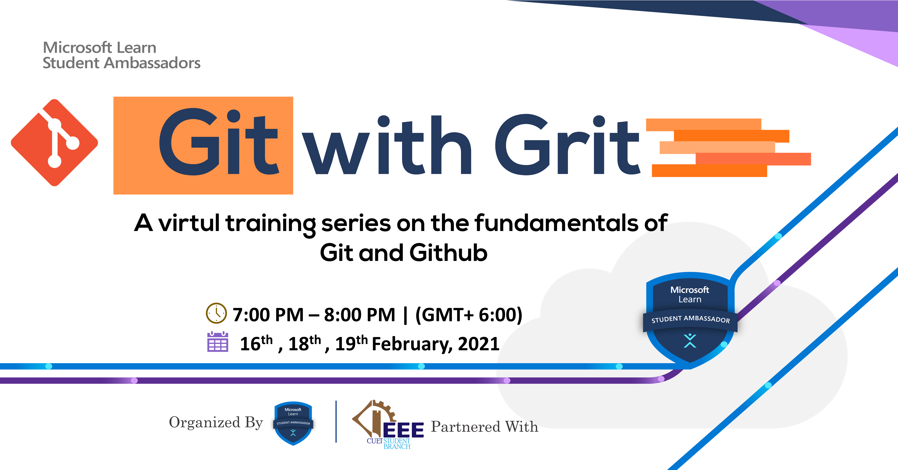

# Git with Grit
### A Virtual Training Series on the Fundamentals of Git and Github
 

  

 

## :scroll: Event Snippet

In this training series, we will be learning Git. It is a free and open-source **distributed version control system** designed to handle everything from small to very large projects with speed and efficiency. 
We will be also exploring **Github** which is a code hosting platform for version control and collaboration. It lets you and others collaborate together on the same projects from anywhere so that we can collaborate with others from a remote repository. 
Apart from these learnings, we will also be hearing from **Mr. Jakaria Rabbi** who is currently a _Github Campus Advisor_ at Khulna University of Engineering and Technology (KUET). He will be sharing us various ideas regarding **Github Campus Advisor** and **Github Campus Expert** Program.

**This Training Series is covering following topics :**
- Command Line and Git Environment
- Git Basic Commands
- Git Branching
- Working on Remote Repository
- Exclusive talk on "Github Campus Expert"
- Insights on "Github Campus Advisor"

 

## :movie_camera: Event Recording

[Full Playlist](https://www.youtube.com/playlist?list=PLIQ7u2lvft7xVH7RyND4AZx776aHcbn65) Available on **YouTube**

## :star: Credits
Organizer : [Mohammad Iftekher Ebne Jalal (Iftu)](https://github.com/Iftu119) (Ambassador)  
Speaker : [Anjum Rashid Bijoy](https://github.com/bijoy26) (Ambassador)  
Guest Speaker : [Jakaria Rabbi](https://github.com/Jakaria08)  
Partnering Organization : [IEEE CUET Student Branch](http://www.ieeecuetsb.org/)

----
